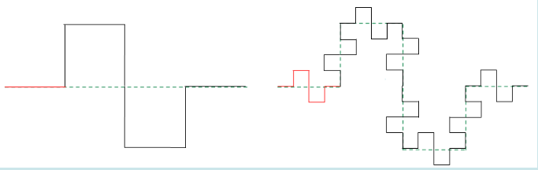
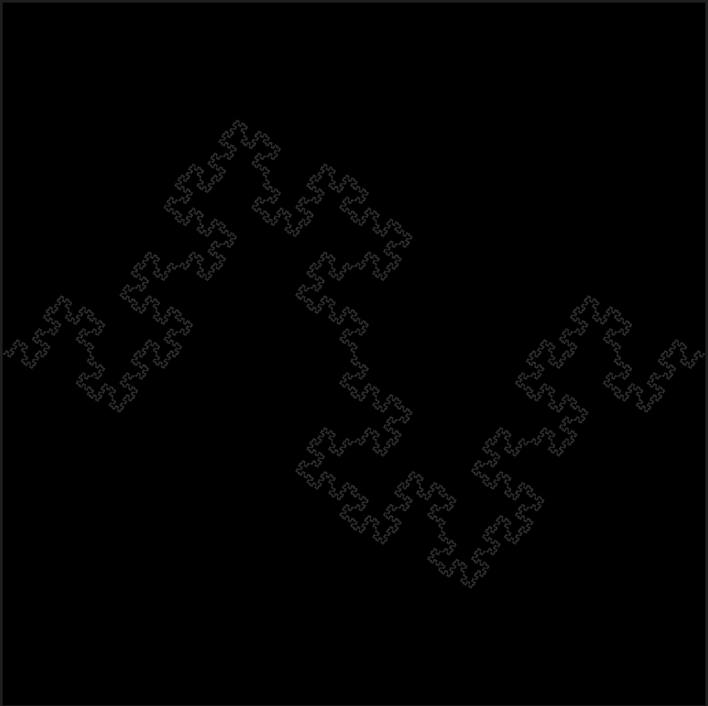
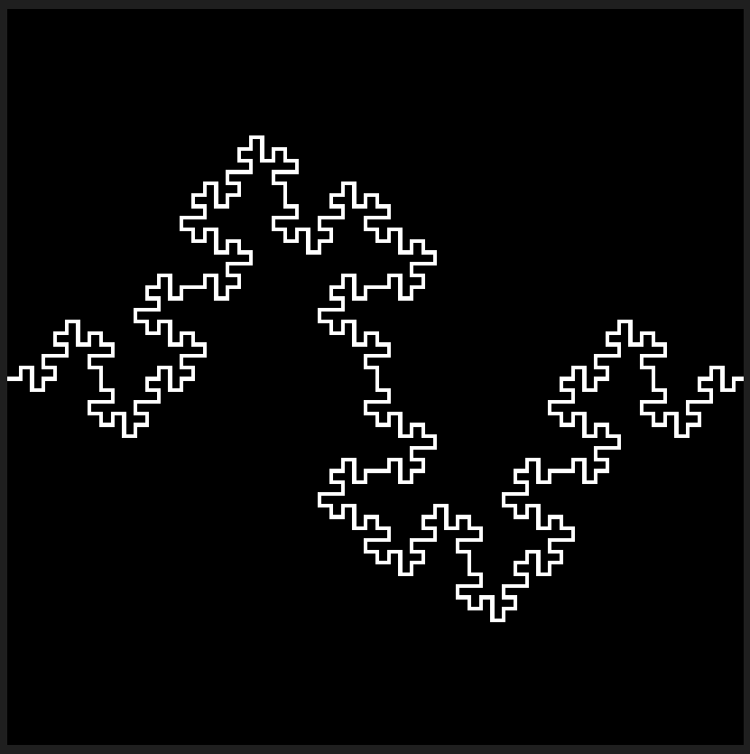
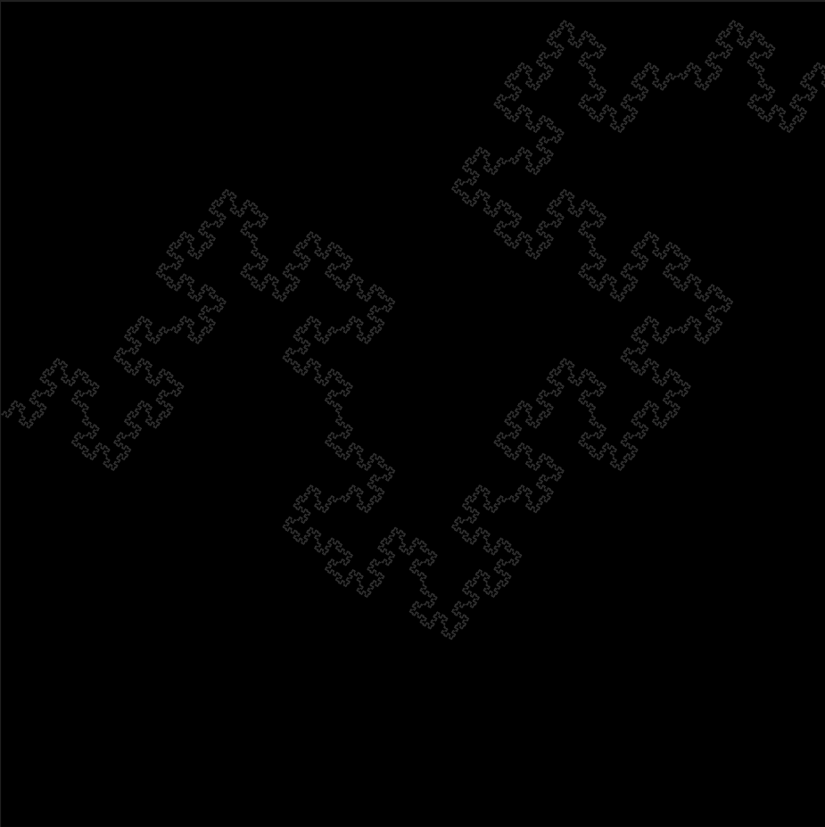

# Description:
- Python program for creating an image of a recursive pattern displayed using a BMP file.
- Two use cases:
    1. a depth is given - the program resizes the image to fit the fractal.
    2. a pixel width is given - the program stops drawing the fractal as soon as it reaches the specified width.

# Instructions:
* Change values:
    * ds - list of desired depth values to generate the fractals with,
    * ws - same as ds, but for desired widths,
    * line_len - (pixel) length of the drawn lines.
* Run "main.py"

# File structure:
* "main.py" - the entire program
* "output" - gotten result
* "images" - images for showcasing in readme

# Todo : 
* ~~BMP file printing template~~
* ~~Recursive algorithm for pattern~~
* ~~Dynamic file size resizing~~
* ~~Stopping program when at given width~~
* ~~Benchmarking and graphing~~

## Pattern to replicate (Minkowski Sausage):

## Example output
* depth = 6:

* depth = 3

* width = 15000

## References:
- Inspiration for the main recursion function: https://github.com/George-Ogden/Turtle-Projects/blob/master/Minkowski%20Sausage.py
    - Other (omitted) inspiration - https://github.com/spirometaxas/minkowski-sausage-cli/blob/main/src/index.js
- Definition: https://en.wikipedia.org/wiki/Minkowski_sausage